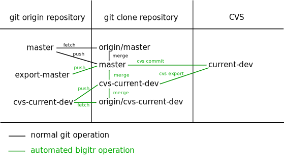

Bigitr
======

Bigitr is a tool that copies content bidirectionally between Git
and CVS repositories in an asynchronous and asymmetric fashion.
(You can configure only CVS->Git, only Git->CVS, or bidirectional
copying; separately for each repository you are synchronizing.)
The name *Bigitr* is intended to convey at least bidirectionality,
an emphasis on Git over CVS, and that it helps to *beget* Git
repositories from CVS repositories.

Unlike Git's cvsimport, Bigitr does not attempt to assemble
changesets out of CVS into separate Git commits.  It merely takes
snapshots of the current (at the time of the snapshot) state of CVS,
using the `cvs export` command.  Similarly, it does not export Git
commits separately into CVS; it writes only the current (at the time)
latest content from the specified Git branch into CVS.

The flow is conceptually similar to Git's flow for synchronizing
with a remote repository.  For example, in Git, the local `master`
branch is pushed to the `master` branch on the `origin` repository,
pulled from the `origin` remote's `master` branch to the local
`origin/master` reference, and then the local `origin/master`
reference is merged onto the local `master` branch.  Similarly, in
Bigitr, the Git `master` branch might be exported to a CVS branch
named `current-dev`, which is then imported into a Git branch named
`cvs-current-dev`, which then might be merged back into the Git
`master` branch.  A remote `export-master` branch tracks what has
been exported from the `master` branch to CVS.

The bidirectional synchronization is not intended to allow developers
to develop in their choice of CVS or Git indefinitely.  Bigitr should
be used in order to move primary development of a branch from CVS
to Git.  After that, the purpose of merging changes from CVS into Git
is to preserve the content of changes that have to be made in CVS,
without preserving context (changeset or commit messages).

Bigitr is a power tool, and like all power tools, it is dangerous.
It commits to CVS and pushes to remote Git repositories.
Wrong configuration or bugs in Bigitr can be very destructive to
your source code, both in CVS and in Git.  Do backups, and test
configuration initially with throwaway copies of CVS and Git
repositories, before you put this tool into production use.

Reserved Branch Names
---------------------

Branches in the Git repositories with names starting with `cvs-`
and `export-` are reserved to be written only by Bigitr.
These branches are pushed to the origin repository so that local
state does not need to be maintained.  This means that multiple
users can run this tool using the same repository configuration
but different application configuration (local directories).
However, no locking is attempted, so if two users run it at the
same time, the results are undefined.

Bigitr imports branches from CVS into special import branches (with
names starting with "cvs-") in Git.  It also exports branches in
Git into branches in CVS.  It will not touch the CVS trunk (at
least at this time).

Note: It will not synchronize only parts of a CVS `sub/module`.  It is
all or nothing: for any particular `sub/module`, any files not in
the Git branch being exported to CVS will be **deleted** from that
branch in that CVS `sub/module`.

It records which content has been pushed from a Git branch into
CVS by using another branch on the origin with a name that
starts with `export-`.  If you export the Git `master` branch
to CVS, Bigitr will track what has been exported using the
`export-master` branch.  It uses this to attach Git commit
messages to CVS commits.  It makes no attempt to attach CVS
commit messages to Git commits.

Merging
-------

After committing to branches (not including fast-forwarding the
export- branches), Bigitr will automatically attempt to merge changes
into other explicitly-specified branches.  If any merges are
successful, those merges themselves may trigger other merge
operations.

It is reasonable to configure no automatic merging at all.  Be,
aware that if you have configured the Git "master" branch to be
exported to an existing CVS branch, then you should populate the
Git "master" branch before exporting.

Any branch that you export from Git to CVS, including master,
must be populated before you export it.  You may populated it
by merging from a branch imported from CVS, either manually or
by configuring an automatic merge.

Files in CVS ignored by .gitignore will not be committed to the
corresponding Git branches, and if those .gitignore changes are
represented on a branch being exported from Git into CVS, those
files will be deleted from the CVS branch when the Git branch
is exported to CVS.

Files with names starting with ".git" will not be commited to CVS;
that file namespace is reserved for Git, even for Git metadata file
types that have not yet been created as of the time that this tool
was written.

Bigitr tries to notice entirely empty branches and should refuse to
delete entire CVS `sub/modules`.  An attempt to export an empty Git
branch to a CVS branch will raise an exception rather than deleting
all the files on the CVS branch.  However, even a single file is
enough to override this security check.)  (If you really want to
delete all the files on the CVS branch, do it using CVS directly.)

It is recommended that only Git metadata files with names starting
with .git be included in "skeletons" used to populate empty
branches, because the protections against accidentally exporting
empty branches to CVS apply only to Git metadata files.  Putting
any other files in a skeleton may cause you to delete a CVS
`sub/module` due to misconfiguring a repository in Bigitr.

Hooks
-----

There are pre-commit and post-commit hooks for both Git and CVS,
in order to implement normalization rules, notification, and so
forth.  These commands are run with the current working directory
set to the Git working directory or CVS checkout.  These can be
specified for all repositories or for a single repository, and
for all branches or only individual branches.  Any arguments are
included in the configuration using shell syntax; no extra
arguments are added by Bigitr at run time.  Hooks that exit with
an error cause the current Bigitr repository operation to halt
immediately, though additional repositories will still be processed.

Configuration
-------------

There are three kinds of bigitr configuration files.

* Application configuration: general behavior

* Repository configuration: specific to a Git repository

* Daemon configuration: behavior of the bigitrd daemon

Each of these kinds of configuration files use "ini" syntax.
This is intentionally similar to Git configuration.  Any syntax
differences are due to using the Python ConfigFile parser to
implement the configuration file handling.

These files support using `#` characters for comments.  It is normal
to *comment out* configuration lines that do not currently apply
but might apply later.

The values in these files can include environment variables,
which must be specified using the `${VARNAME}` syntax.

In addition, there are skeleton directories containing initial
files for populating new branches, hooks that are called before
and after commits, and working directories in which CVS and
Git operations are done and log files are stored.

### Application configuration ###

A bigitr configuration file (by default, the file named by
the `BIGITR_APP_CONFIG` environment variable, or `~/.bigitr`
if it is not set, or provided via the `--appconfig` option)
has three sections:

    # Comment
    [global]
    gitdir = /path/to/directory/holding/git/repositories
    logdir = /path/to/log/directory
    compresslogs = true
    mailfrom = sendinguser@host
    smarthost = smtp.smarthost.name

    [import]
    onerror = abort # abort|warn|continue
    cvsdir = /path/to/directory/for/cvs/export

    [merge]
    onerror = abort # abort|warn|continue

    [export]
    preimport = true # false to overwrite whatever is in CVS
    onerror = abort # abort|warn|continue
    cvsdir = /path/to/directory/for/cvs/checkouts

To avoid permissions problems, it is **very strongly** recommended
that none of the directories be shared between different users
running Bigitr. The only reasonable exception is `logdir`, which
may use the *sticky bit* (like `/tmp` typically uses) to allow
all users to log output and errors to the same locations for all
converted repositories.

Typically, all of the directories (except possibly `logdir`) are
subdirectories of a single parent directory.  Also, `logdir` is
the only directory that contains information of potentially durable
value.  When Bigitr is not running, it is not generally harmful
to remove any of the directories; Bigitr will re-create them as
necessary.  The logs are voluminous, and contain errors and output
created while Bigtr is running.  This includes errors and output
from hooks.  The logs will be compressed unless `global.compresslogs`
is set to `false`.  They are intended to be potentially useful for
forensic investigation when things go wrong.

In order to share configuration between users, it is best to use
environment variables for variable parts of the path.  A typical
configuration might be:

    [global]
    logdir = ${BIGITR_LOG}/log
    gitdir = ${BIGITR_DATA}/git

    [import]
    onerror = abort
    cvsdir = ${BIGITR_DATA}/export

    [merge]
    onerror = warn

    [export]
    preimport = true
    onerror = abort
    cvsdir = ${BIGITR_DATA}/import

*   `global.logdir`: This directory contains subdirectories,
    one per repository, with logs of output (one each for standard
    output and standard error) from commands run by Bigitr.
    This is the only work directory that should generally be on
    durable storage, and the only work directory that may (with
    appropriate permissions) be shared among multiple users of
    Bigitr.

*   `global.gitdir`: This contains cloned Git repositories.
    Do not use these for normal development purposes.  Bigitr
    throws away any outstanding work in the working directories,
    so any changes you have made will be destroyed.

*   `import.cvsdir`: This contains per-repository subdirectories
    which Bigitr populates by running `cvs export`.

*   `export.cvsdir`: This contains per-repository, per-branch
    directories which Bigitr populates by running `cvs checkout`.

### Repository configuration ###

A bigitr repository configuration file (by default, the file
named by the `BIGITR_REPO_CONFIG` environment variable, or
`~/.bigitr-repository` if it is not set, or provided via the
`--config` option) has one section per repository, plus an optional
`GLOBAL` (all capitals, preserving `global` as a possible real
repository name) section that is inherited by all the repository
sections in that file.

    [GLOBAL]
    gitroot = git@host # <gitroot>:<repositoryname>
    cvsroot = :pserver:${USER}@servername:/path
    skeleton = ${BIGITR_CONF}/path/to/general/skeleton

    [Path/To/Git/repository]
    cvspath = Path/To/CVS/directory
    skeleton = ${BIGITR_CONF}/path/to/repository/skeleton
    branchfrom = <gitspec> # branch/tag/ref to branch from for new branch imports
    cvs.<branch> = <gitbranch> # CVS <branch> imports to "cvs-<gitbranch>" in Git
    git.<branch> = <cvsbranch> # Git <branch> exports to "<cvsbranch>" in CVS
    merge.<sourcebranch> = <targetbranch> <targetbranch> # Merge <sourcebranch> onto <targetbranch>(es)
    prefix.<branch> = <message> # prefix for CVS commit messages on <branch>
    email = <address> <address> # errors/warnings emailed to these addresses
    cvsvar.<variable> = <value> # for CVS, use -s <variable>=<value>

    prehook.git = <command> <args> # hook to run in Git clone before committing to either Git or CVS
    prehook.imp.git = <command> <args> # hook to run in Git clone before committing to Git from CVS
    prehook.exp.git = <command> <args> # hook to run in Git clone before committing to CVS from Git
    prehook.cvs = <command> <args> # hook to run in CVS checkout before committing to CVS

    posthook.git = <command> <args> # hook to run in Git clone after committing to either Git or CVS
    posthook.imp.git = <command> <args> # hook to run in Git clone after committing to Git from CVS
    posthook.exp.git = <command> <args> # hook to run in Git clone after committing to CVS from Git
    posthook.cvs = <command> <args> # hook to run in CVS checkout after committing to CVS

    prehook.git.<branch> = <command> <args> # hook to run in Git clone before committing to Git branch <branch> or exporting it to CVS
    prehook.imp.git.<branch> = <command> <args> # hook to run in Git clone before committing to Git branch <branch> from CVS
    prehook.exp.git.<branch> = <command> <args> # hook to run in Git clone before committing to CVS from Git branch <branch>
    prehook.cvs.<branch> = <command> <args> # hook to run in CVS checkout before committing to CVS branch <branch>

    posthook.git.<branch> = <command> <args> # hook to run in Git clone after committing to Git branch <branch> or exporting it to CVS
    posthook.imp.git.<branch> = <command> <args> # hook to run in Git clone after committing to Git branch <branch> from CVS
    posthook.exp.git.<branch> = <command> <args> # hook to run in Git clone after committing to CVS from Git branch <branch>
    posthook.cvs.<branch> = <command> <args> # hook to run in CVS checkout after committing to CVS branch <branch>

The `gitroot`, `cvsroot`, `email`, `skeleton` keys, and general
(non-branch-specific) hooks, may be in the `GLOBAL` section. Entries
in the `GLOBAL` section will be overridden by any specific
per-repository values.  The `branchfrom` and all branch-specific
keys (`cvs.*`, `git.*`, `merge.*`, and `prefix.*`) must be specified
only in specific repository sections.

Each repository is specified by the path relative to the `gitroot`
and the *basename* must be unique for all repositories that share
working directories.  Bigitr will enforce that the basenames are
unique for a particular repository configuration file.  If you
cannot guarantee uniqueness between repository configuration files,
then you must use different work directories in different application
configuration (`global.logdir`, `global.gitdir`, `import.cvsdir`, and
`export.cvsdir`) for each repository configuration.

skeleton files are used only when creating a new `cvs-*` import branch.
Note that changing the skeleton between creating `cvs-*` import branches
will introduce merge conflicts when you merge `cvs-*` branches into
Git development branches.  Any skeleton files other than `.git*` files
will be included in the files exported from Git branches to CVS branches.
The normal use of a skeleton is to introduce a `.gitignore` file that is
different from `.cvsignore` and/or a `.gitattributes` file; if there is no
skeleton and there is a top-level `.cvsignore` file, new branches will
include the contents of `.cvsignore` as the initial `.gitignore` contents.

For each `git.<branch>`, `export-<branch>` in Git is used to track what
on `<branch>` has been exported to CVS.  This branch never has anything
committed to it.  It only gets fast-forward merges from `<branch>`.  It
is used to track what is new in order to create commit messages.

`merge.<sourcebranch> = <targetbranch>` specifies merges to attempt; if
git reports a successful merge with a 0 return code, the merge will
be pushed.  This merge will be done after operations that modify
`<sourcebranch>`, such as importing a cvs branch into git, or another
merge operation.  Typical usage is therefore:

    merge.cvs-foo = bar baz
    merge.bar = master

This would mean that when the `foo` branch is imported from cvs, it
will be merged onto the `bar` and `baz` branches in git; furthermore,
if the merge onto `bar` is successful, `bar` will then be merged onto
`master`.

When doing a git branch export with the default setting of
`export.preimport = true`, if there are any merge failures from
the preimport, then the git branch export will be aborted.

All hooks are run in the obvious directory; git hooks are run in a
git working directory with the specified branch checked out, and
cvs hooks are run in a cvs checkout in which the specified branch
is a sticky tag.  The pre hooks are run before a commit operation,
and post hooks are run after all post-commit operations are complete;
for example, the cvs post hooks are run after fast-forwarding the
`export-` branch.  Git post hooks are run before merging downstream
branches, and Git post hooks (but not pre hooks at this time; this
may be changed later) are run for each merge target as well as for
cvs import branches.

Per-branch hooks (e.g. `prehook.git.master`) are run in addition to
general hooks (e.g. `prehook.git`) and the general hooks are run
first.  Per-direction hooks (e.g. `prehook.imp.git`,
`prehook.imp.git.master`) are are run after their bidirectional
equivalents.

Hooks that modify Git state are generally discouraged.  Committing
may invalidate invariants and cause unexpected operation.
Changing branches will almost certainly break in terrible and
unexpected ways.  The main use for pre hooks is to normalize the
contents of files to be committed in ways that are not implemented
as specific configuration.  The main use for post hooks is arbitrary
notification.

Sample hooks are provided in the libexec directory.

When writing hooks as shell scripts, it is normally best to use the
`-e` option to exit the script with an error if any program that is
invoked exits with an unhandled error.  This will halt processing
for that repository.

### Tool configuration ###

Bigitr intentionally honors Git and CVS configuration.  That is,
it is intended to be used with appropriate `.gitconfig` and
`.cvsrc` files in place.  Git configuration should include at
least appropriate configuration of `user.name` and `user.email`.
Bigitr invokes `cvs diff` without format arguments, assuming that
you will have chosen configuration for your preferred diff format.
An appropriate .cvsrc might include lines such as:

    diff -uN
    update -Pd

Bigitr does not handle authentication; it assumes that Git and CVS
are set up already authenticated.  You will have to run `cvs login`
before running Bigitr if your configuration requires CVS login
authentication.

### Daemon configuration ###

A daemon that synchronizes bigitr on a schedule is also included.
You can run bigitr from cron, but if you do so, you will need to
do your own locking to avoid running two instances in parallel
against the same repositories.  You can instead run the bigitrd
daemon which implements its own locking, and can iterate over as
many application configurations and repository configurations as
you like.

A bigitrd configuration file (by default, the file named by the
`BIGITR_DAEMON_CONFIG` environment variable, or `~/.bigitrd` if it
is not set, or provided via the `--config` option to bigitrd) has
one section per application configuration file, plus an optional
`GLOBAL` (all capitals) section that is inherited by all the
application configuration sections in that file.

    [GLOBAL]
    # currently, parallel conversion is not implemented
    parallel = 1
    pollfrequency = 5m
    syncfrequency = 1d
    appconfig = /path/to/default/appconfig
    email = recipient@host other@anotherhost
    mailfrom = sender@host
    smarthost = machine.that.speaks.smtp
    mailall = false

    [human-readable name]
    appconfig = /path/to/this/appconfig
    repoconfig = /path/to/this/repoconfig

    [another human-readable name]
    # appconfig inherited
    repoconfig = /path/to/many/repository/configs*

*   `GLOBAL.parallel`: not currently implemented; reserved for
    implementing parallel conversions in the future (like the
    make `-j` option).

*   `GLOBAL.pollfrequency`: Minimum frequency at which to check
    Git repositories to see whether they have additional commits
    since the last synchronization.  This is the minimum time to
    wait since the previous poll or sync started.  If bigitrd is
    waiting for long-running conversions of some repositories,
    then it can take longer between poll operations.  Specified in
    days, hours, minutes, and seconds.  If no units are specified,
    seconds are assumed.  `1h20m10s` would be one hour, twenty
    minutes, and ten seconds.  Five minutes (`5m`) is the default.
    Bigitrd determines whether to sync based on whether `git fetch`
    changes any refs.

*   `GLOBAL.syncfrequency`: Minimum frequency at which to synchronize,
    whether or not bigitrd sees a change to the Git repository.
    Specified just like `GLOBAL.pollfrequency`.  The default is
    `1d`.  If `syncfrequency` is shorter than `pollfrequency`, then
    polling will never be used to determine whether to synchronize.
    The first synchronization pass after bititrd starts or restarts
    will always be a full synchronization.

*   `GLOBAL.email`: Email address to send errors from bigitrd itself.
    This does not override errors from the conversion process, which
    are mailed to the email addresses specified in repository config
    files.  This is the address that should get tracebacks from the
    operation of the daemon itself, outside of the conversion process.
    `GLOBAL.mailfrom` must also be set to send email.

*   `GLOBAL.mailfrom`: Sender email address for errors mail from
    bigitrd itself.  `GLOBAL.email` must also be set to send email.

*   `GLOBAL.smarthost`: Hostname of system that speaks SMTP.  Defaults
    to `localhost`.

*   `GLOBAL.mailall`: Mail all repository errors, as well as daemon
    errors, to all `GLOBAL.email` addresses.  This cases bigitrd to
    add `GLOBAL.email` to the list of addresses for which email will
    be sent for all repositories processed, even if those repositories
    have no other email addresses included in their repository
    configuration.

*   `[name].appconfig`: Path (not a glob) to a single application
    configuration file that should be used for the `[name]` section.

*   `[name].repoconfig`: Space-separated list of globs for repository
    configuration files that should be used with the associated
    application configuration files in the `[name]` section.

Running Bigitr
--------------

The `bigitr` program takes subcommands (like CVS and Git) and has
a common argument structure.  It takes three options:

*   `-h` or `--help`: Print a help summary

*   `-a` or `--appconfig`: Specify an application configuration file
    to use instead of the file named by the `BIGITR_APP_CONFIG`
    environment variable or `~/.bigitr`.

*   `-c` or `--config`: Specify a repository configuration file
    to use instead of the file named by the `BIGITR_REPO_CONFIG`
    environment variable or `~/.bigitr-repository`.

After the options, the `bigitr` program takes subcommands, some of
which may be followed by optional repository/branch specifiers.
Repositories may be specified by basename or by complete path;
that is, if a repository configuration file has a section named
`[/path/to/GitRepository]`, then a repository might be specified on
the command line as `/path/to/GitRepository` or as `GitRepository`.
In order to specify a branch, use the `::` to separate the branch
name from the repository name.  If you have a repository with `::`
in the name of the repository, use an additional trailing `::`
to specify all branches in that repository.

*   `help`: Ignores all further arguments, acts just like `--help`

*   `sync`: Runs all configured synchronization, including all
    configured exports from Git branches to CVS branches, all
    imports from CVS branches into Git branches, and all configured
    Git merges from target Git branches.  If `export.preimport` is
    true (the default), CVS imports and the resulting Git merges
    will be done both before and after the Git exports to CVS.
    If no repositories are specified, the synchronization is run
    for all configured repositories; otherwise, it is run for the
    specified repositories.

    The `sync` command is the normal full operation command.

    The `sync` command does not honor branch specifications,
    because the branch specification would be ambiguous between
    Git branches and CVS branches.  Branch specifications for
    `sync` may be silently ignored.

*   `import`: Runs all configured imports from CVS branches into
    Git branches, and all subsequent merges, for all configured
    or only for specified repositories.  Branch specifications
    apply to CVS branches, not Git branches.

*   `export`: Runs all configured exports from Git branches into
    CVS branches, for all configured or only for specified
    repositories.  Even if `export.preimport` is true (the
    default), no pre-import is run.  Therefore, this will overwrite
    content from CVS that has not been yet been imported into its
    corresponding Git branch, if there have been CVS commits since
    the last import operation.  Branch specification apply to Git
    branches, not CVS branches.

*   `merge`: Runs all configured merges for Git branches for all
    repositories, or for specified repositories, or for specified
    branches of specified repositories.  Even if branches are
    specified, all configured cascading merges will be performed.

Running Bigitrd
---------------

The `bigitrd` program takes only a few options, and does not have
subcommands.

*   `-h` or `--help`: Print a help summary

*   `-c` or `--config`: Specify a bigitrd configuration file
    to use instead of the file named by the `BIGITR_DAEMON_CONFIG`
    environment variable or `~/.bigitrd`.

*   `-n` or `--nodaemon` or `--no-daemon`: Do not detach from
    the shell when run; stay as a foreground process.

*   `-p` or `--pidfiles` or `--pid-file`: Specify the name of the
    file in which bigitrd will store its pid instead of the file
    named by the `BIGITR_DAEMON_PIDFILE` environment variable or
    `~/.bigitrd-pid`.  Note that the same files with the suffix
    `.lock` (e.g. `~/.bigitrd-pid.lock`) will also be created, as
    will other lock files in the same directory.

Bigitrd responds to the `SIGHUP` signal by waiting until any current
conversions are finished, and then re-execing itself with the same
configuration with which it was originally invoked, which causes the
configuration to be re-read.  Note that `SIGHUP` is not required for
bigitrd to close log files, as the log files for each repository are
closed as soon as each synchronization cycle is finished.  After it
reinvokes itself, it will do a full synchronization cycle rather
than polling Git for updates.

Bigitrd responds to the SIGTERM signal by waiting until any current
conversions are finished, and then exiting gracefully.

Requirements
============

Bigitr depends on precise behavior of Git and CVS.  The behavior
of this tool should be validated after *any* update to any of the
programs which it calls: git, cvs, any programs called from any
configured hooks; as well as after any other update that might
affect them (libraries, system language configuration, etc.).
A test suite is provided to help validate this behavior.  If you
discover failures not exposed by the test suite, please augment the
test suite.  In particular, additional functional tests or story
tests would be appropriate.  To run all the tests, invoke the command
`make alltests` and confirm that all the tests complete successfully.

This tool automates only (part of) the **process** of synchronization
between Git and CVS branches.  It does not automate any **monitoring**
of the results.  *Do not relax monitoring because you are using it.*
For example, if you have changemail notification on CVS, do not disable
it for branches that are developed in Git and pushed to CVS; use that
changemail to confirm that the synchronization process has worked.

Bigitr also assumes essentially unlimited argument length, as it
passes arbitrarily many file names on the command line.  This limits
it to working on relatively recent Linux kernels (2.6.23 and later)
for large repositories.  At least Python 2.5 is required (due to the
use of "with").

Bigitr requires nose (may be packaged as python-nose), coverage
(may be packaged as python-coverage), and mock (may be packaged as
python-mock).  If your version of python does not include argparse,
you will need the externally-packaged argparse (may be packaged as
python-argparse) as well.  The bigitrd daemon requires daemon (may
be packaged as python-daemon), lockfile (may be packaged as
python-lockfile), and setproctitle (may be packaged as
python-setproctitle).

The documentation is maintained in markdown.

Status
======

As of this writing, Bigitr is considered alpha-quality software.
It has been tested with a few dozen CVS/Git repository pairs.
It is in active production use with close monitoring.  It is
actively maintained.

Life Cycle
==========

A typical life cycle for Bigitr is envisioned to be:

* Introduced to allow developers to use Git for new development
  while still enabling processes based on CVS.  Synchronization
  is done bidirectionally, because some processes or people might
  still commit to CVS even through primary development has moved
  to Git.

* Several older CVS branches are imported into Git, with automatic
  merging configured into `master`, so that maintenance fixes done
  in CVS for older versions maintained in CVS will be applied also
  in the latest product maintained in Git.

* Git and CVS repository hooks are installed to call Bigitr on
  push or commit, respectively.

* All processes/people then move to Git for source code control, so
  Git branches no longer need to be exported to CVS.  At this time,
  the configuration is modified to disabled export of Git branches
  to CVS branches, but the import and merge configuration is retained.
  The Git repository hooks are therefore removed, so Bigitr is invoked
  only when CVS commits occur.

* All old maintenance branches in CVS are no longer maintained in
  CVS, and Bigitr is no longer used.

Contributing
============

Reporting bugs is a contribution.  Please report bugs using the
github issue tracker at https://github.com/mikjo/bigitr/issues

For contributing modifications, the following description describes
the policy which will be used for evaluating and possibly accepting
the modifications.  It does not supersede any terms of the license.

If you make modifications, you may offer those modifications
to be included bigitr by using a "pull request" in Github.  All
contributions must be under the terms and conditions of the Apache
License; contributions offered otherwise will not be accepted.

In order to avoid merge failures, we request that your "prominent
notices stating that You changed the files" as required by the
Apache License be in the form of correct and complete name and correct
email address in the `Author` field of the Git commits that you
submit, rather than changes to the *contents* of the files that you
modify.  You may, of course, add appropriate copyright statements.

Contributions which include modifications to the source code are
requested to include appropriate tests for the changes.  New or
modified tests should cover all of the changed and affected code,
maintaining 100% code coverage overall.

License
=======

Licensed under the Apache License, Version 2.0 (the "License");
you may not use this file except in compliance with the License.
You may obtain a copy of the License at

    http://www.apache.org/licenses/LICENSE-2.0

Unless required by applicable law or agreed to in writing, software
distributed under the License is distributed on an "AS IS" BASIS,
WITHOUT WARRANTIES OR CONDITIONS OF ANY KIND, either express or implied.
See the License for the specific language governing permissions and
limitations under the License.

Copyright 2012 SAS Institute
